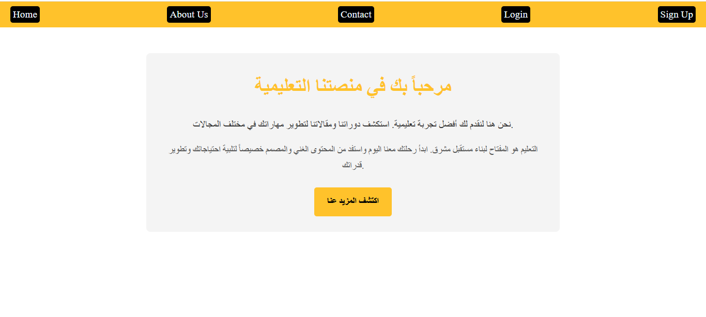
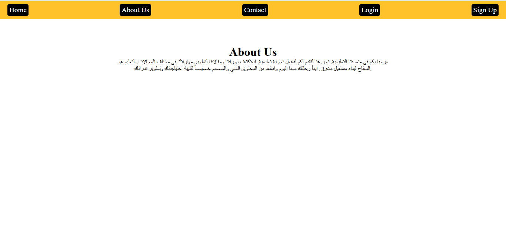
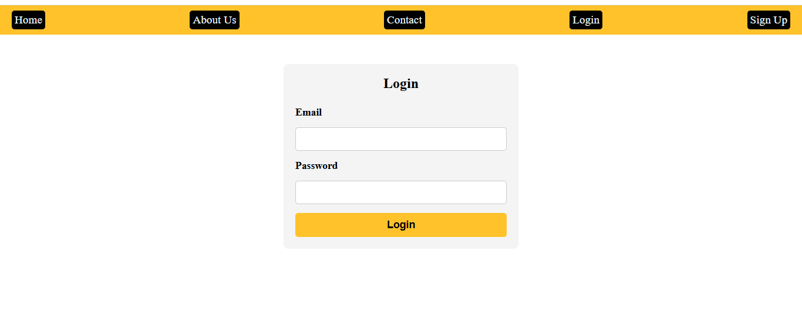
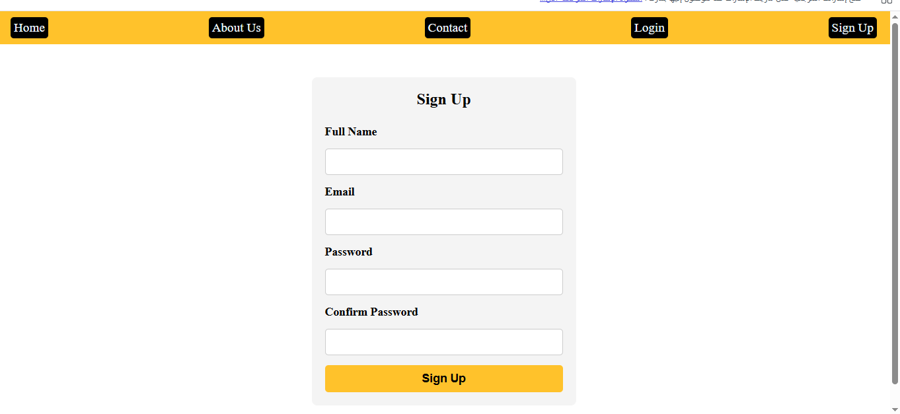
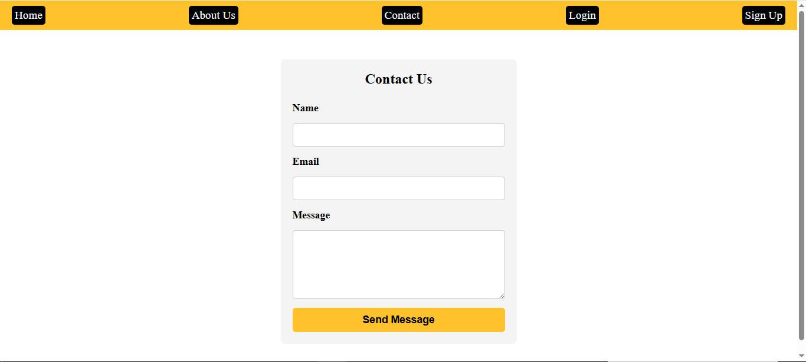

# 🎓 المنصة التعليمية (Educational Platform)

مرحباً بكم في مستودع مشروع **المنصة التعليمية**. هذا المشروع عبارة عن واجهة مستخدم (Front-End) حديثة وبسيطة، تم تصميمها لتكون متجاوبة بالكامل (Fully Responsive) لتعمل بكفاءة على جميع الأجهزة (الهواتف الذكية، الأجهزة اللوحية، وأجهزة الكمبيوتر).

يهدف هذا المشروع إلى توفير بيئة تعليمية سهلة الاستخدام للطلاب، حيث يمكنهم تصفح الدورات، تسجيل الدخول، وإنشاء حسابات جديدة بكل سهولة.

---

## 📸 واجهات المشروع (Project Screenshots)

نستعرض هنا صوراً لواجهات المشروع المختلفة بنسختيها (سطح المكتب والهاتف المحمول):

### 1. الصفحة الرئيسية (Home Page)

تعتبر الواجهة الترحيبية للمنصة، وتحتوي على رسالة تحفيزية للطلاب للبدء في التعلم.
**نسخة سطح المكتب:**

**نسخة الهاتف:**

### 2. صفحة من نحن (About Us)

تعرض معلومات عن المنصة وأهدافها التعليمية.
**نسخة سطح المكتب:**

**نسخة الهاتف:**

### 3. صفحة تسجيل الدخول (Login)

نموذج بسيط وآمن لتسجيل دخول الطلاب إلى حساباتهم.
**نسخة سطح المكتب:**

**نسخة الهاتف:**

### 4. صفحة إنشاء حساب (Sign Up)

تتيح للطلاب الجدد التسجيل في المنصة والبدء في رحلتهم التعليمية.
**نسخة سطح المكتب:**

**نسخة الهاتف:**

### 5. صفحة اتصل بنا (Contact Us)

نموذج للتواصل مع إدارة المنصة لأي استفسارات أو دعم فني.
**نسخة سطح المكتب:**

**نسخة الهاتف:**

---

## 🛠️ التقنيات المستخدمة (Technologies Used)

تم بناء هذا المشروع باستخدام تقنيات الويب الأساسية لضمان سرعة الأداء وسهولة التعديل:

- **HTML5**: لبناء هيكل الصفحات.
- **CSS3**: لتنسيق الصفحات وإضافة الألوان والخطوط.
- **Media Queries**: لجعل التصميم متجاوباً مع الشاشات الصغيرة (الهواتف والتابلت).

---

## 🚀 كيفية التشغيل (How to Run)

لا يحتاج هذا المشروع إلى أي إعدادات معقدة أو خوادم (Servers). لتشغيل المشروع:

1. قم بتحميل المستودع (Clone the repository).
2. افتح مجلد المشروع.
3. انقر نقراً مزدوجاً على ملف `index.html` ليتم فتحه في متصفح الويب الافتراضي لديك.

---

_تم تطوير هذا المشروع بشغف لدعم العملية التعليمية وتسهيل وصول الطلاب للمحتوى._
